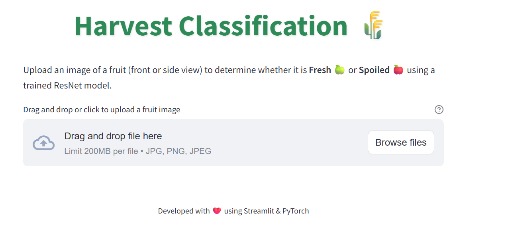
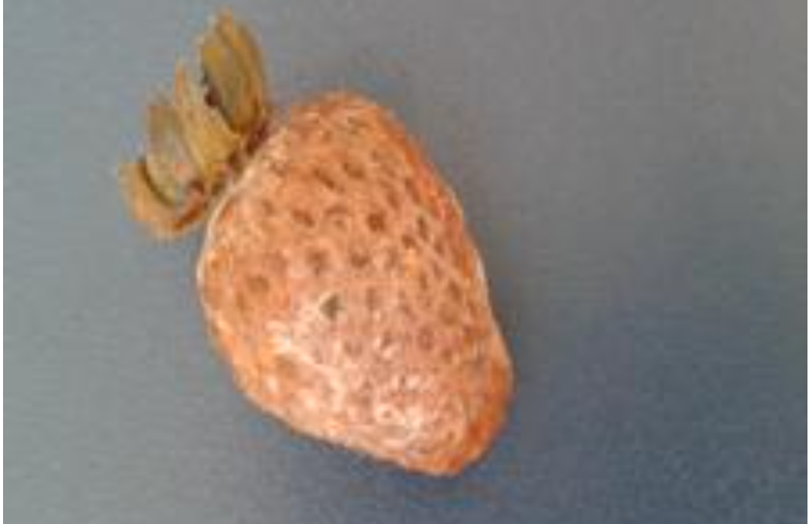

# 🌾 Harvest Classification — CodeBasics Virtual Internship (Weeks 5 & 6)

An end-to-end **Deep Learning project** developed for the **CodeBasics Virtual Internship**, focused on **automated fruit freshness detection** using computer vision.  
The system predicts whether a fruit is **Fresh 🍃** or **Spoiled 🍂**, powered by multiple CNN architectures and deployed with Streamlit.

---

## 🎯 Objective

To build, train, tune, and deploy a deep learning pipeline capable of classifying fruit images as *fresh* or *spoiled* across multiple fruit types.

---

## 📦 Dataset

The dataset `FreshHarvest_Dataset` contains **8 fruit categories**, each with **Fresh (F_)** and **Spoiled (S_)** image folders:

> Banana | Lemon | Lulo | Mango | Orange | Strawberry | Tamarillo | Tomato

**Directory structure:**
```
FreshHarvest_Dataset/
 ├── F_Banana/
 ├── S_Banana/
 ├── F_Lemon/
 ├── S_Lemon/
 ├── ...
```

All images were augmented using:
- Random rotation (±15°)
- Horizontal flips
- Color jitter (brightness, contrast, saturation)
- Normalization with ImageNet statistics

---

## 🧠 Models Trained

Several CNN architectures were trained and compared in `dl_virtual_internship.py`.

| Model | Description | Key Features | Accuracy |
|:--|:--|:--|:--:|
| **HarvestClassifierCNN** | 3 Conv + 2 FC | Baseline CNN | ~84% |
| **CNN + Regularization** | Added BatchNorm & Dropout (0.5) | Better generalization | ~88% |
| **EfficientNet-B0** | Transfer learning | Efficient, fewer params | ~93–94% |
| **ResNet-50** | Fine-tuned (layer4 unfrozen) | Strong generalization | 95%+ |
| **ResNet-50 (Tuned)** | Optuna-tuned hyperparameters | Best performing model | **96%+** |

---

## ⚙️ Hyperparameter Tuning

Tuning was automated with **Optuna** (`hyperparameter_tunning.py`), testing 20 trials of learning-rate and dropout combinations.

| Parameter | Search Range | Best Value |
|:--|:--|:--|
| Learning Rate | 1e-5 → 1e-2 | `0.0001073` |
| Dropout Rate | 0.2 → 0.7 | `0.6033` |
| Optimizer | Adam | — |
| Epochs | 3 (for tuning) | — |

The best configuration was later applied to fine-tune **ResNet-50**, yielding a +1.5 % gain in validation accuracy.

---

## 📊 Model Evaluation

Final model: **ResNet-50** with Optuna-optimized hyperparameters.

| Metric | Value |
|:--|:--:|
| Training Accuracy | 98% |
| Validation Accuracy | 96% |
| Test Accuracy | 95% |
| F1-Score | 0.96 |

✅ Excellent distinction between “Fresh” and “Spoiled” fruits  
✅ Minimal confusion between similar fruits (e.g., oranges vs. lemons)

The trained model weights were saved as:
```
model/saved_model.pth
```

---

## 🖼️ Screenshots

Below are visuals from the Streamlit application interface .






---

## 🚀 Streamlit Deployment

A simple yet elegant **Streamlit** interface (`app.py`) enables real-time fruit classification using the trained model (`model_helper.py`).

### ✨ Features
- 📤 Upload an image (`.jpg`, `.jpeg`, `.png`)
- 🔍 Instant classification with model inference
- 🍃 Green for *Fresh*  
- 🍂 Red for *Spoiled*
- Modern, responsive UI with Streamlit

### Run locally
```bash
pip install -r requirements.txt
streamlit run app.py
```

---

## 🧩 Project Structure
```
code_basics_virtual_internship_week_5_to_6/
 ├── dl_virtual_internship.py         # All model training experiments
 ├── hyperparameter_tunning.py        # Optuna-based tuning script
 ├── model_helper.py                  # ResNet architecture + inference logic
 ├── app.py                           # Streamlit app for deployment
 ├── model/
 │    └── saved_model.pth             # Final trained model weights
 ├── screenshots/
 │    ├── training_overview.png
 │    ├── app_interface.png
 │    └── prediction_result.png
 ├── requirements.txt                 # Dependencies list
 └── README.md                        # (this file)
```

---

## 🧾 Requirements

```
streamlit==1.43.2
torch==2.7.1
torchvision==0.22.1
Pillow
numpy
matplotlib
optuna
scikit-learn
```

---

## 📈 Insights

- 🧱 Custom CNNs provided a strong baseline, but transfer learning improved performance dramatically.  
- ⚙️ Regularization (BatchNorm + Dropout) stabilized training.  
- 🧩 Optuna tuning fine-tuned ResNet hyperparameters for optimal results.  
- 📊 Augmentation played a crucial role in reducing overfitting and improving generalization.

---

## 🔮 Future Enhancements

- 📱 Deploy to **Hugging Face Spaces** or **Streamlit Cloud**  
- 🧺 Extend dataset to include vegetables and multi-fruit frames  
- ⚡ Add real-time camera inference

---

## 👨‍💻 Author

**Somesh Joshi**  
🎓 *CodeBasics Virtual Internship — Weeks 5 & 6*  
🔗 [GitHub Profile](https://github.com/joshisomesh1996-star)

---

## 🪪 License
Released under the **MIT License** — free for learning, research, and educational use.
